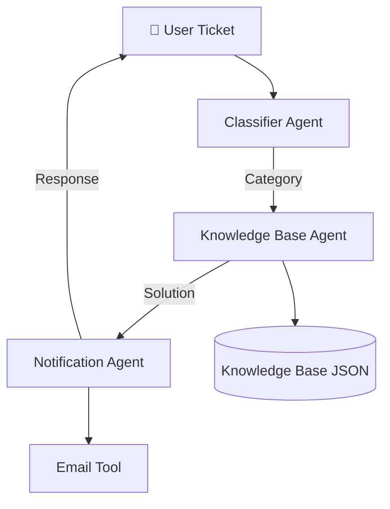

---

title: MTOR Intelligent IT Resolver
emoji: "🤖"
colorFrom: blue
colorTo: indigo
sdk: docker
app_port: 7860
pinned: false
tags:
  - openenv
  - multi-agent
  - it-support

---


# 🚀 MTOR – Intelligent, Script-Driven Support


> **MTOR (Multi-agent Ticket Orchestrator & Resolver)** is an AI-powered system that automates IT ticket resolution using intelligent agents, structured knowledge, and tool-driven workflows.

---

# 🌍 Environment Overview & Motivation

Traditional IT support systems are:

* Slow ⏳
* Manual 👨‍💻
* Repetitive 🔁

MTOR introduces a **multi-agent AI environment** where:

* Agents collaborate to resolve tickets
* Knowledge is reused via structured storage
* Actions like notifications are automated

---

# 🧠 System Architecture

1. **Classifier Agent** → Categorizes the issue
2. **Knowledge Base Agent** → Retrieves solution
3. **Notification Agent** → Sends response

---

## 🏗️ Architecture Diagram



---

# 📁 Project Structure

```
MTOR/
├── agents/
├── data/
├── tools/
├── utility/
├── api.py
├── Dockerfile
├── requirements.txt
└── README.md
```

---

# ⚙️ Setup Instructions

```bash
pip install -r requirements.txt
python app.py
```

---

# 🐳 Docker Usage

```bash
docker build -t mtor-app .
docker run -p 7860:7860 mtor-app
```

---

# 🚀 Deployment

This project is deployed using **Hugging Face Spaces (Docker)**.

---

# 📄 License

MIT License
